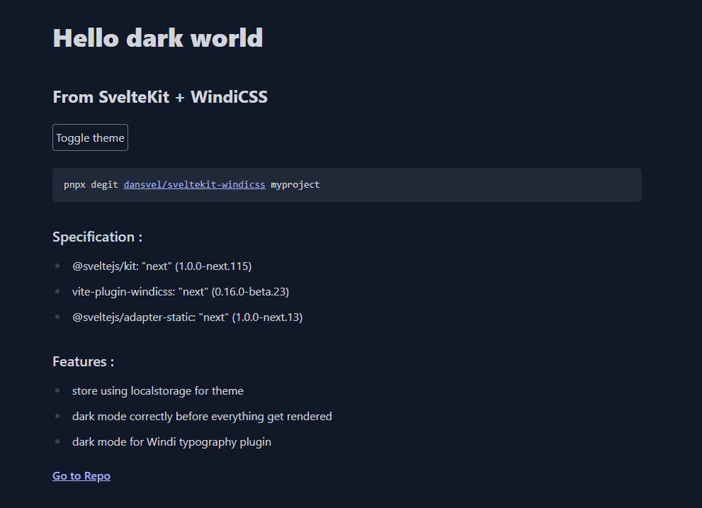

# SvelteKit ❤️ Windi template

## Specification
- @sveltejs/kit: "next" (1.0.0-next.115)
- vite-plugin-windicss: "next" (0.16.0-beta.23)
- @sveltejs/adapter-static: "next" (1.0.0-next.13)

## Features
- store using localstorage for theme
- dark mode correctly before everything get rendered
- dark mode for Windi typography plugin

## Demo

[**Live Demo**](https://sveltekit-windi.netlify.app)

## Running the project

Clone this repo and cd to the directory, then run npm or yarn

```bash
pnpx degit dansvel/sveltekit-windicss myproject ## or npx
cd myproject
pnpm i ## or npm or yarn
pnpm run dev

## to generate static web
pnpm run build
```